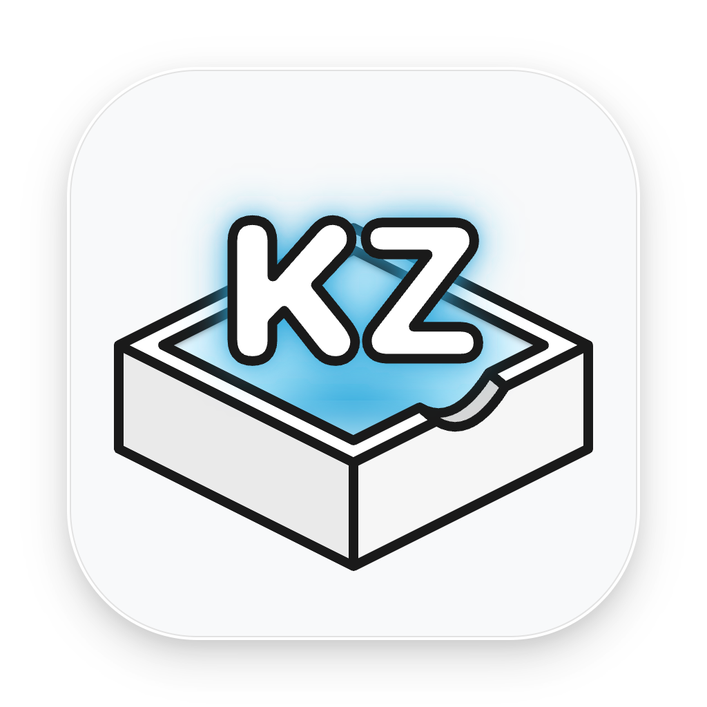

  

<h1 align="center">SaveTik_KZ</h1>

  The 100% native Swift macOS version of SaveTik_KZ.

---

## About This Repository

This repository is the **fully native macOS edition (Pure Swift Native Edition)** of [SaveTik_KZ](https://github.com/KnightZhu7/SaveTik_KZ).

- **Pure Native Architecture**: Completely removes the Python runtime, FastAPI local service, and external browser dependencies (DrissionPage / Chromium) from the original version, enabling instant startup with zero runtime dependencies and minimal system resource usage.
- **Algorithm & Protocol Porting**: The underlying network requests, anti-bot security parameters, and core cryptographic signing algorithms are based on the renowned open-source project [f2 (Johnserf-Seed/f2)](https://github.com/Johnserf-Seed/f2), and have been **100% rewritten in pure Swift**.

---

## Documentation & Features

For detailed information about this project's features—including **quality/codec filtering, Live Photo export to Photos** and UI previews — **[please visit the main project repository](https://github.com/KnightZhu7/SaveTik_KZ)**

---

## Download Latest Release

**[SaveTik_KZ V2.0.1](https://github.com/KnightZhu7/SaveTik_KZ-f2/releases/tag/V2.0.1)**

---

## Acknowledgements & License

- **SaveTik_KZ** is distributed under the **MIT License**. See [LICENSE](LICENSE) for details.
- This project ports cryptographic and protocol signature logic derived from [f2](https://github.com/Johnserf-Seed/f2) by [JohnserfSeed](https://github.com/Johnserf-Seed), licensed under the **Apache License, Version 2.0**.